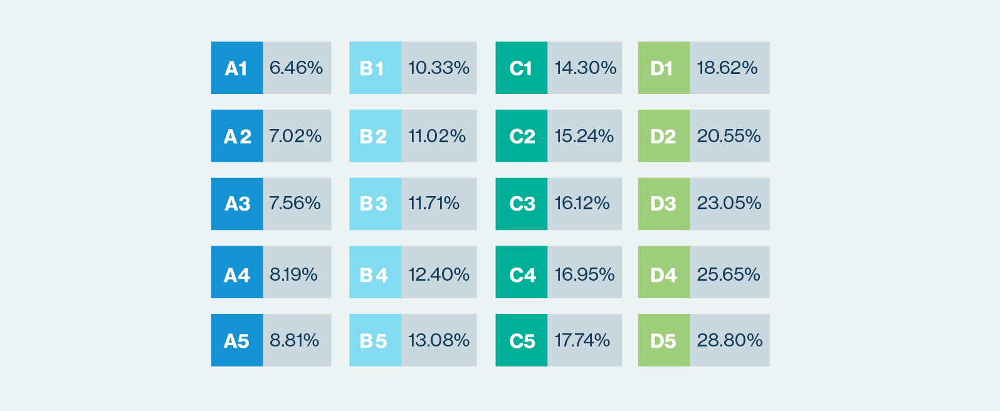

# Dataset

The data is sourced as a _SQLite_ database that was imported as a `dataframe` with the `RSQLite` package. The variables were reformatted according to their respective types. 

We also sourced US zip and FIPS codes, and macroeconomical data for possible geographical statistics. The source code for the data import and reformatting is given in appendix.

## Preamble

The LendingClub dataset, although rich, is difficult to interpret. The only explanation of what the variables mean comes from a spreadsheet attached to the dataset. The explanations are not precise and/or subject to conflicting interpretation. Despite serching the LendingClub website, no further original information was found. We collected a number of reasonable assumptions in Appendix. 

The dataset has been used a number of times in the past by various people. One paper [@kim2019ensemble] mentions they used a dataset that included 110 variables, which is less than ours with 145 variables. The dataset has changed over time in ways we do not know.

## General presentation

The original dataset is rich: it includes `r nrow(lending_club)` loan samples, each containing `r ncol(lending_club)` variables (after the identification variables filled with null values). The dataset represents a total of ca.$34bln in loan principals, which is a substantial share of the total amount stated to have been intermediated to date by LC (reported to be $50bln+). 

### Identification

The dataset is anonymised (all identifying ID numbers are deleted) and we therefore removed those columns from the dataset. Since the identification `ID`s have been removed to anonymise the dataset, we cannot see if a borrower borrowed several times.

### Loan lifecyle and status

In the dataset, less loans are still outstanding than matured or "_charged off_" (term that LC use to mean partially or fully written off, i.e. there are no possibilty for LC and/or the investors to receive further payments). The share of outstanding loans is:

```{r share-of-live-portfolio}
# Share of portfolio currently 'live'
local({
  n_current <- lending_club %>%
    filter(!(
      loan_status %in% c(
        "Charged Off",
        "Does not meet the credit policy. Status:Charged Off",
        "Does not meet the credit policy. Status:Fully Paid",
        "Fully Paid"
      )
    )) %>%
    nrow()
  
  n_samples <- lending_club %>% nrow()
  cat("Share of current loans = ",
      round(100 * n_current / n_samples, 3),
      "%")
})
```


The dataset describes the life cycle of a loan. In the typical (ideal) case, we understand it to be:

$$ 
\text{Loan is approved}  \rightarrow  \text{Full amount funded by investors} \rightarrow \text{Loan marked as Current} \rightarrow \text{Fully Paid}
$$

In the worst case, it is:

$$ 
\text{Loan is approved}  \rightarrow  \text{Full amount funded by investors} \rightarrow \text{Loan marked as Current} \rightarrow 
$$

$$
\rightarrow \text{Grace period (missed payments under 2 weeks)} \rightarrow \text{Late 15 to 31 days} \rightarrow
$$

$$
\rightarrow  \text{Late 31 to 120 days} \rightarrow  \text{Default} \rightarrow  \text{Charged Off}
$$

Note that _Default_ precedes and is distinct from _Charged Off_ ^[See LendingClub FAQ at https://help.lendingclub.com/hc/en-us/articles/215488038]. A couple of things could happen to a loan in default: 

+ LC and the borrower restructure the loan with a new repayment schedule, where the borrower may repay a lesser amount over a longer period; or,

+ the claim could be sold to a debt recovery company that would buy the claim from LC/investors. This would be the final payment (if any) received by LC and the investors.

The dataset also describes situations where a borrower negotiated a restructuring of the repayment schedule in case of unexpected hardship (e.g. disaster, sudden unemployment). 

Note that this progression of distinguishing default (event in time) and actual financial loss mirrors what banks and rating agencies do> The former is called the _Probability of Default_ (PD), the latter _Loss Given Default_ (LGD). Ratings change over time (in a process resembling a Markov Chains). LGD show some correlations with ratings. The dataset, although detailed, does not include the full life of each loan to conduct this sort of analysis (change of loan quality over time). This is an important reason why we decided to focus on the loan approval and expected return.


### Loan application

Before a loan is approved, the borrower undergoes a review process that assess his/her capacity to repay. This includes:

+ employment situation and income, as well whether this income and possibly its source has been independently verified;

+ whether the application is made jointly (likely with a partner or a spouse, but there are no details);

+ housing situation (owner, owner with current mortgage, rental) and in which county he/she lives (that piece of information is partially anonymised by removing the last 2 digits of the borrower's zipcode);

+ the amount sought, its tenor and the purpose of the loan; and,

+ what seems to be previous credit history (number of previous deliquencies). The dataset is very confusing in that regard: it is clear that such information relates to before the loan is approved in the case of the joint applicant. In the case of the principal borrower however, the variable descriptions could be read as pre-approval information, or information gathered during the life of the loan. We have assumed that the information related to the principal borrower is also pre-approval. We also used _Sales Supplements_ from the LC website^[See https://www.lendingclub.com/legal/prospectus] that describe some of the information provided to investors. LendingClub also provides a summary description of its approval process in its regulatory filings with the Securities Exchange Commission [@LC201908S3]. 


### Interest rates

Based on this information, the loan is approved or not. Approval includes the final amount (which could be lower than the amount requested), tenor (3 or 5 years) and a rating similar to those given to corporate borrowers. Unlike corporate borrowers however, the rating mechanically determines the rate of interest according to a grid known to the borrower in advance^[https://www.lendingclub.com/investing/investor-education/interest-rates-and-fees]. The rates have changed over time. Those changes where not as frequent as market conditions (e.g. changes in Federal Reserve Bank's rates)^[Corporate borrowers would negociate interest margins on a case-by-case basis despite similar risk profiles.]. 

Figure \@ref(fig:interest-rate-table) ^[source: https://www.lendingclub.com/investing/investor-education/interest-rates-and-fees] shows the predetermined interest rate depending on the initial rating as of July 2019. 

```{r interest-rate-table, fig.cap="Interest rates given rating",fig.height=5,cache=FALSE}

```

At the date of this report, the ratings range from `A` (the best) down to `D`, each split in 5 sub-ratings. However, LC previously also intermediated loans rated F or G (until 6 November 2017) and E (until 30 June 2019) ^[See https://www.lendingclub.com/info/demand-and-credit-profile.action]. This explains that such ratings are in the dataset. We will assume that the ratings in the dataset are the rating at the time of approval and that, even if loans are re-rated by LC, the dataset does not reflect it.

Figures \@ref(fig:interest-over-time) shows the change in interest rate over time for different ratings and separated for each tenor. (Each figure is on a sample of 100,000 loans.) For each rating, we can see several parallel lines which correspond to the 5 sub-rating of each rating. We note that the range of interest rates has substantial widened over time. That is, the risk premium necessary to attract potential investors has had to substantially increase. In the most recent years, the highest rates exceed 30% which is higher than many credit cards.3-year loans are, unsurprinsingly, considered safer (more A-rated, less G-rated). Identical ratings attract identical rates of interest.

```{r interest-over-time, fig.cap="Interest rate per grade over time"}
interest36 <- loans %>%
  sample_n(100000) %>%
  filter(term == 36) %>%
  ggplot(aes(issue_d, int_rate, col = grade)) +
  geom_point(alpha = 0.15) +
  ggtitle("Interest rate per grade over time \n 3-year loans") +
  xlab("Funding date") +
  ylab("Interest rate")

interest60 <- loans %>%
  sample_n(100000) %>%
  filter(term == 60) %>%
  ggplot(aes(issue_d, int_rate, col = grade)) +
  geom_point(alpha = 0.15) +
  ggtitle("Interest rate per grade over time \n 5-year loans") +
  xlab("Funding date") +
  ylab("Interest rate")

grid.arrange(interest36, interest60, nrow = 1)
```

By comparison, we plot the 3-year (in red) and 5-year (in blue) bank swap rates in Figure \@(fig:swap-rates). We see that the swap curve has flattened in recent times (3-year and 5-y rates are almost identical). We also can see that in broad terms the interest rates charged reflect those underlying swap rates. It is therefore most relevant to examine the credit margins added to the swap rates.


```{r swap-rates, fig.cap="Historical Swap Rates"}
RATES %>%
  filter(DATE >= ymd("2008-01-01")) %>%
  ggplot(aes(DATE, RATE3Y, RATE5Y)) +
  geom_line(aes(DATE, RATE3Y), col = "red") +
  geom_line(aes(DATE, RATE5Y), col = "blue")
```


Figures \@ref(fig:margin-over-time) shows the change in credit margin over time for different ratings and separated for each tenor. (Each figure is on a sample of 100,000 loans.) As above, for each rating, we can see several parallel lines which correspond to the 5 sub-rating of each rating. We note that the range of credit margins has widened over time but less than the interest rates. Identical ratings attract identical credit margins.

```{r margin-over-time, fig.cap="Credit margins per grade over time"}
margin36 <-
  loans %>%
  filter(term == 36) %>%
  sample_n(100000) %>%
  select(issue_d, int_rate, grade) %>%
  rename(DATE = issue_d) %>%
  left_join(RATES, by = "DATE", copy = TRUE) %>%
  mutate(Margin = int_rate - RATE3Y) %>%
  ggplot(aes(DATE, Margin, col = grade)) +
  geom_point(alpha = 0.15) +
  ggtitle("Credit margin per grade over time \n 3-year loans") +
  xlab("Funding date") +
  ylab("Credit margin")

margin60 <-
  loans %>%
  filter(term == 60) %>%
  sample_n(100000) %>%
  select(issue_d, int_rate, grade) %>%
  rename(DATE = issue_d) %>%
  left_join(RATES, by = "DATE", copy = TRUE) %>%
  mutate(Margin = int_rate - RATE5Y) %>%
  ggplot(aes(DATE, Margin, col = grade)) +
  geom_point(alpha = 0.15) +
  ggtitle("Credit margin per grade over time \n 5-year loans") +
  xlab("Funding date") +
  ylab("Credit margin")

grid.arrange(margin36, margin60, nrow = 1)
```

[TODO: DTI, amount... by grade]

### Payments

The loans are approved for only two tenors, 3 and 5 years, with monthly repayments. Installments are calculated easily with the usual formula:

$$
Installment = Principal \times \frac{1}{1 - \frac{1}{(1+rate)^N}}
$$


Where $Principal$ is the amount borrowed, $rate = \frac{\text{Quoted Interest Rate}}{12}$ is the monthly interest rate, and $N$ is the number of installments (36 or 60 monthly payments). The following piece of code shows that the average error between this formula and the dataset value is about 2 cents. We therefore precisely understand this variable.


```{r installment-amount-error,echo=TRUE,eval=FALSE}
local({
  installmentError <- loans %>%
    mutate(
      PMT = round(funded_amnt * int_rate / 12 / (1 - 1 / (1 + int_rate / 12) ^
                                                   term), 2),
      PMT_delta = abs(installment - PMT)
    ) %>%
    select(PMT_delta)
  
  mean(100 * installmentError$PMT_delta)
})
```


## Variables

We here present the dataset in a bit more details The full list of variable is given in appendix (see Table \@ref(tab:variable-description)). This dataset will be reduced as we focused on our core question: _Are LC's loans priced appropriately?_.

### General

The loans were issued from `r min(lending_club$issue_d)` to `r max(lending_club$issue_d)`. About 60% of the portfolio is fully repaid. See Table \@ref(tab:loan-per-status).

```{r loan-per-status}
local({
  nloans <- nrow(lending_club)
  
  lending_club %>%
    group_by(loan_status) %>%
    summarise(Number = n()) %>%
    mutate(Proportion = round(100 * Number / nloans, 3)) %>%
    kable(
      "latex",
      caption = "Number of loans per status",
      booktabs = T,
      # longtable = T,
      col.names = c("Loan status", "Count", "Proportion (%)")
    ) %>%
    kable_styling(latex_options = c("repeat_header")) %>%
    column_spec(1, width = "8.5cm") %>%
    column_spec(2, width = "2.5cm") %>%
    column_spec(3, width = "3.5cm")
})
```


#### Business volume

Figure \@ref(fig:business-volume-per-month) plots the number, volume (cumulative principal amount) and average principal per loan shows that the business grew exponentially (in the common sense of the word) since inception until 2016. At this point, according to Wikipedia ^[source: https://en.wikipedia.org/wiki/LendingClub - Retreival date 15 September 2019]:


" _Like other peer-to-peer lenders including Prosper, Sofi and Khutzpa.com, LendingClub experienced increasing difficulty attracting investors during early 2016. This led the firm to increase the interest rate it charges borrowers on three occasions during the first months of the year. The increase in interest rates and concerns over the impact of the slowing United States economy caused a large drop in LendingClub's share price._"


The number and volume of loans plotted have been aggregated by month. The growth is very smooth in the early years, and suddenly very volatile. As far as the first part of the dataset is concerned, a starting business could expect to be volatile and could witness a yearly cycle (expected from economic consumption figures) superimposed on the growth trend. This is not the case. 


An interesting metric is that the average principal of loans has increased (see Figure \@ref(business-volume-per-month), on a sample of 100,000 loans). Partly, the increase in the early years could be interpreted success in confidence building. This metric plateau-ed in 2016 and decreased afterwards, but to a much lesser extent than the gross volume metrics. However, it is more volatile than the two previous metrics in the early years. 

By the end of the dataset, all metrics have essentially recovered to their 2016 level.


```{r business-volume-per-month, fig.cap="Business volume written per month", fig.fullwidth=TRUE}
volume1 <- lending_club %>%
  mutate(Monthly = ceiling_date(issue_d, unit = "month")) %>%
  group_by(Monthly) %>%
  summarise(Number_of_written_loans = n()) %>%
  ggplot(aes(Monthly, Number_of_written_loans)) +
  geom_line(color = "blue") +
  ylab("Number of loans") + geom_smooth(color = "red", method = "loess")


volume2 <- lending_club %>%
  mutate(Monthly = ceiling_date(issue_d, unit = "month")) %>%
  group_by(Monthly) %>%
  summarise(Volume = sum(funded_amnt) / 1000000) %>%
  ggplot(aes(Monthly, Volume)) +
  geom_line(color = "blue") +
  ylab("Volume of loans ($mln)") + geom_smooth(color = "red", method = "loess")


volume3 <- lending_club %>%
  mutate(Monthly = ceiling_date(issue_d, unit = "month")) %>%
  group_by(Monthly) %>%
  summarise(Average = mean(funded_amnt)) %>%
  ggplot(aes(Monthly, Average)) +
  geom_line(color = "blue") +
  ylab("Average loan size ($ per loan)") + geom_smooth(color = "red", method = "loess")

grid.arrange(volume1, volume2, volume3, nrow = 1)
```


## Loan decision 

As indicated in the introduction, our focus is on loans that have gone through their entire life cycle to consider their respective pricing, risk and profitability. To that effect, we will remove all loans which are still current (either performing or not). From here on, everything will be based on this reduced dataset. 

In this reduced dataset, we focus on loans that have matured or been terminated. It contains  `r nrow(loans)` samples. Most of the loans (ca.80%) have been repaid in full. See Table \@ref(tab:matured-loans).


```{r matured-loans}
# Share of portfolio currently 'live'
loans %>%
  group_by(loan_status) %>%
  summarise(Number = n()) %>%
  mutate(Share = round(100 * Number / n(), 3)) %>%
  arrange(desc(Number)) %>%
  kable(
    "latex",
    caption = "Matured loans per status",
    booktabs = T,
    # longtable = T,
    col.names = c("Loan status", "Count", "Proportion (%)")
  ) %>%
  kable_styling(latex_options = c("repeat_header")) %>%
  column_spec(1, width = "6cm") %>%
  column_spec(2, width = "4cm") %>%
  column_spec(2, width = "4cm")

```


When grouped by grade (Figure \@ref(fig:funded-by-subgrade)), we see a clear correlation between grade and default: the lower the grade the higher the portion defaults (all the way down to about 50%). In addition, most of the business is written in the B- or C-rating range.


```{r funded-by-subgrade, , fig.cap="Funding and Write-offs by Sub-grades"}
loanSizeSummary <-
  loans %>%
  group_by(sub_grade) %>%
  summarise(
    Funded = sum(funded_amnt) / 1000000,
    Repaid = sum(total_rec_prncp) / 1000000
  ) %>%
  mutate(Proportion = 100 * Repaid / Funded)

loanBySubgrade1 <-
  loanSizeSummary %>%
  ggplot(aes(x = sub_grade, Funded)) +
  geom_point() +
  xlab("Sub grade") +
  ylab("Funded amount ($mln)")

loanBySubgrade2 <-
  loanSizeSummary %>%
  ggplot(aes(x = sub_grade, y = Proportion)) +
  geom_point() +
  xlab("Sub grade") +
  ylab("Share repaid (%)")

grid.arrange(loanBySubgrade1, loanBySubgrade2, ncol = 1)
```

 

```{r list-of-variables,echo=FALSE}


# Creates the full list of variables, including :
#   inModel: used as a model variable?
#   isOutput: output of the model?
LC_variable <-
  data.frame(
    variable_name = "1",
    inModel = "N",
    isOutput = FALSE,
    description = "a"
  ) %>%
  add_row(
    variable_name = 'loan_amnt',
    inModel = "Y",
    isOutput = FALSE,
    description = 'The listed amount of the loan applied for by the borrower. If at some point in time, the credit department reduces the loan amount, then it will be reflected in this value.'
  ) %>%
  add_row(
    variable_name = 'funded_amnt',
    inModel = "N",
    isOutput = FALSE,
    description = 'The total amount committed to that loan at that point in time.'
  ) %>%
  add_row(
    variable_name = 'funded_amnt_inv',
    inModel = "N",
    isOutput = FALSE,
    description = 'The total amount committed by investors for that loan at that point in time.'
  ) %>%
  add_row(
    variable_name = 'term',
    inModel = "Y",
    isOutput = FALSE,
    description = 'The number of payments on the loan. Values are in months and can be either 36 or 60.'
  ) %>%
  add_row(
    variable_name = 'int_rate',
    inModel = "Y",
    isOutput = FALSE,
    description = 'Interest Rate on the loan'
  ) %>%
  add_row(
    variable_name = 'installment',
    inModel = "Y",
    isOutput = FALSE,
    description = 'The monthly payment owed by the borrower if the loan originates.'
  ) %>%
  add_row(
    variable_name = 'grade',
    inModel = "Y",
    isOutput = FALSE,
    description = 'LC assigned loan grade. THIS RATING IS CONFUSING. '
  ) %>%
  add_row(
    variable_name = 'sub_grade',
    inModel = "Y",
    isOutput = FALSE,
    description = 'LC assigned loan subgrade'
  ) %>%
  add_row(
    variable_name = 'emp_title',
    inModel = "Y",
    isOutput = FALSE,
    description = 'The job title supplied by the Borrower when applying for the loan.*'
  ) %>%
  add_row(
    variable_name = 'emp_length',
    inModel = "Y",
    isOutput = FALSE,
    description = 'Employment length in years. Possible values are between 0 and 10 where 0 means less than one year and 10 means ten or more years. '
  ) %>%
  add_row(
    variable_name = 'home_ownership',
    inModel = "Y",
    isOutput = FALSE,
    description = 'The home ownership status provided by the borrower during registration or obtained from the credit report. Our values are: RENT, OWN, MORTGAGE, OTHER'
  ) %>%
  add_row(
    variable_name = 'annual_inc',
    inModel = "Y",
    isOutput = FALSE,
    description = 'The self-reported annual income provided by the borrower during registration.'
  ) %>%
  add_row(
    variable_name = 'verification_status',
    inModel = "Y",
    isOutput = FALSE,
    description = 'Indicates if income was verified by LC, not verified, or if the income source was verified'
  ) %>%
  add_row(
    variable_name = 'issue_d',
    inModel = "Y",
    isOutput = FALSE,
    description = 'The month which the loan was funded'
  ) %>%
  add_row(
    variable_name = 'loan_status',
    inModel = "Y",
    isOutput = FALSE,
    description = 'Current status of the loan'
  ) %>%
  add_row(
    variable_name = 'pymnt_plan',
    inModel = "Y",
    isOutput = FALSE,
    description = 'Indicates if a payment plan has been put in place for the loan'
  ) %>%
  add_row(
    variable_name = 'url',
    inModel = "Y",
    isOutput = FALSE,
    description = 'URL for the LC page with listing data.'
  ) %>%
  add_row(
    variable_name = 'desc',
    inModel = "Y",
    isOutput = FALSE,
    description = 'Loan description provided by the borrower'
  ) %>%
  add_row(
    variable_name = 'purpose',
    inModel = "Y",
    isOutput = FALSE,
    description = 'A category provided by the borrower for the loan request. '
  ) %>%
  add_row(
    variable_name = 'title',
    inModel = "Y",
    isOutput = FALSE,
    description = 'The loan title provided by the borrower'
  ) %>%
  add_row(
    variable_name = 'zip_code',
    inModel = "Y",
    isOutput = FALSE,
    description = 'The first 3 numbers of the zip code provided by the borrower in the loan application.'
  ) %>%
  add_row(
    variable_name = 'addr_state',
    inModel = "Y",
    isOutput = FALSE,
    description = 'The state provided by the borrower in the loan application'
  ) %>%
  add_row(
    variable_name = 'dti',
    inModel = "Y",
    isOutput = FALSE,
    description = 'A ratio calculated using the borrower’s total monthly debt payments on the total debt obligations, excluding mortgage and the requested LC loan, divided by the borrower’s self-reported monthly income.'
  ) %>%
  add_row(
    variable_name = 'delinq_2yrs',
    inModel = "Y",
    isOutput = FALSE,
    description = 'The number of 30+ days past-due incidences of delinquency in the borrower\'s credit file for the past 2 years'
  ) %>%
  add_row(
    variable_name = 'earliest_cr_line',
    inModel = "Y",
    isOutput = FALSE,
    description = 'The month the borrower\'s earliest reported credit line was opened'
  ) %>%
  add_row(
    variable_name = 'inq_last_6mths',
    inModel = "Y",
    isOutput = FALSE,
    description = 'The number of inquiries in past 6 months (excluding auto and mortgage inquiries)'
  ) %>%
  add_row(
    variable_name = 'mths_since_last_delinq',
    inModel = "Y",
    isOutput = FALSE,
    description = 'The number of months since the borrower\'s last delinquency.'
  ) %>%
  add_row(
    variable_name = 'mths_since_last_record',
    inModel = "Y",
    isOutput = FALSE,
    description = 'The number of months since the last public record.'
  ) %>%
  add_row(
    variable_name = 'open_acc',
    inModel = "Y",
    isOutput = FALSE,
    description = 'The number of open credit lines in the borrower\'s credit file.'
  ) %>%
  add_row(
    variable_name = 'pub_rec',
    inModel = "Y",
    isOutput = FALSE,
    description = 'Number of derogatory public records'
  ) %>%
  add_row(
    variable_name = 'revol_bal',
    inModel = "Y",
    isOutput = FALSE,
    description = 'Total credit revolving balance'
  ) %>%
  add_row(
    variable_name = 'revol_util',
    inModel = "Y",
    isOutput = FALSE,
    description = 'Revolving line utilization rate, or the amount of credit the borrower is using relative to all available revolving credit.'
  ) %>%
  add_row(
    variable_name = 'total_acc',
    inModel = "Y",
    isOutput = FALSE,
    description = 'The total number of credit lines currently in the borrower\'s credit file'
  ) %>%
  add_row(
    variable_name = 'initial_list_status',
    inModel = "Y",
    isOutput = FALSE,
    description = 'The initial listing status of the loan. Possible values are – W, F'
  ) %>%
  add_row(
    variable_name = 'out_prncp',
    inModel = "Y",
    isOutput = FALSE,
    description = 'Remaining outstanding principal for total amount funded'
  ) %>%
  add_row(
    variable_name = 'out_prncp_inv',
    inModel = "Y",
    isOutput = FALSE,
    description = 'Remaining outstanding principal for portion of total amount funded by investors'
  ) %>%
  add_row(
    variable_name = 'total_pymnt',
    inModel = "Y",
    isOutput = FALSE,
    description = 'Payments received to date for total amount funded'
  ) %>%
  add_row(
    variable_name = 'total_pymnt_inv',
    inModel = "Y",
    isOutput = FALSE,
    description = 'Payments received to date for portion of total amount funded by investors'
  ) %>%
  add_row(
    variable_name = 'total_rec_prncp',
    inModel = "Y",
    isOutput = FALSE,
    description = 'Principal received to date'
  ) %>%
  add_row(
    variable_name = 'total_rec_int',
    inModel = "Y",
    isOutput = FALSE,
    description = 'Interest received to date'
  ) %>%
  add_row(
    variable_name = 'total_rec_late_fee',
    inModel = "Y",
    isOutput = FALSE,
    description = 'Late fees received to date'
  ) %>%
  add_row(
    variable_name = 'recoveries',
    inModel = "Y",
    isOutput = FALSE,
    description = 'post charge off gross recovery'
  ) %>%
  add_row(
    variable_name = 'collection_recovery_fee',
    inModel = "Y",
    isOutput = FALSE,
    description = 'post charge off collection fee'
  ) %>%
  add_row(
    variable_name = 'last_pymnt_d',
    inModel = "Y",
    isOutput = FALSE,
    description = 'Last month payment was received'
  ) %>%
  add_row(
    variable_name = 'last_pymnt_amnt',
    inModel = "Y",
    isOutput = FALSE,
    description = 'Last total payment amount received'
  ) %>%
  add_row(
    variable_name = 'next_pymnt_d',
    inModel = "Y",
    isOutput = FALSE,
    description = 'Next scheduled payment date'
  ) %>%
  add_row(
    variable_name = 'last_credit_pull_d',
    inModel = "Y",
    isOutput = FALSE,
    description = 'The most recent month LC pulled credit for this loan'
  ) %>%
  add_row(
    variable_name = 'collections_12_mths_ex_med',
    inModel = "Y",
    isOutput = FALSE,
    description = 'Number of collections in 12 months excluding medical collections'
  ) %>%
  add_row(
    variable_name = 'mths_since_last_major_derog',
    inModel = "Y",
    isOutput = FALSE,
    description = 'Months since most recent 90-day or worse rating'
  ) %>%
  add_row(
    variable_name = 'policy_code',
    inModel = "Y",
    isOutput = FALSE,
    description = 'publicly available policy_code=1, new products not publicly available policy_code=2'
  ) %>%
  add_row(
    variable_name = 'application_type',
    inModel = "Y",
    isOutput = FALSE,
    description = 'Indicates whether the loan is an individual application or a joint application with two co-borrowers'
  ) %>%
  add_row(
    variable_name = 'annual_inc_joint',
    inModel = "Y",
    isOutput = FALSE,
    description = 'The combined self-reported annual income provided by the co-borrowers during registration'
  ) %>%
  add_row(
    variable_name = 'dti_joint',
    inModel = "Y",
    isOutput = FALSE,
    description = 'A ratio calculated using the co-borrowers\' total monthly payments on the total debt obligations, excluding mortgages and the requested LC loan, divided by the co-borrowers\' combined self-reported monthly income'
  ) %>%
  add_row(
    variable_name = 'verification_status_joint',
    inModel = "Y",
    isOutput = FALSE,
    description = 'Indicates if income was verified by LC, not verified, or if the income source was verified'
  ) %>%
  add_row(
    variable_name = 'acc_now_delinq',
    inModel = "Y",
    isOutput = FALSE,
    description = 'The number of accounts on which the borrower is now delinquent.'
  ) %>%
  add_row(
    variable_name = 'tot_coll_amt',
    inModel = "Y",
    isOutput = FALSE,
    description = 'Total collection amounts ever owed'
  ) %>%
  add_row(
    variable_name = 'tot_cur_bal',
    inModel = "Y",
    isOutput = FALSE,
    description = 'Total current balance of all accounts'
  ) %>%
  add_row(
    variable_name = 'open_acc_6m',
    inModel = "Y",
    isOutput = FALSE,
    description = 'Number of open trades in last 6 months'
  ) %>%
  add_row(
    variable_name = 'open_act_il',
    inModel = "Y",
    isOutput = FALSE,
    description = 'Number of currently active installment trades'
  ) %>%
  add_row(
    variable_name = 'open_il_12m',
    inModel = "Y",
    isOutput = FALSE,
    description = 'Number of installment accounts opened in past 12 months'
  ) %>%
  add_row(
    variable_name = 'open_il_24m',
    inModel = "Y",
    isOutput = FALSE,
    description = 'Number of installment accounts opened in past 24 months'
  ) %>%
  add_row(
    variable_name = 'mths_since_rcnt_il',
    inModel = "Y",
    isOutput = FALSE,
    description = 'Months since most recent installment accounts opened'
  ) %>%
  add_row(
    variable_name = 'total_bal_il',
    inModel = "Y",
    isOutput = FALSE,
    description = 'Total current balance of all installment accounts'
  ) %>%
  add_row(
    variable_name = 'il_util',
    inModel = "Y",
    isOutput = FALSE,
    description = 'Ratio of total current balance to high credit/credit limit on all install acct'
  ) %>%
  add_row(
    variable_name = 'open_rv_12m',
    inModel = "Y",
    isOutput = FALSE,
    description = 'Number of revolving trades opened in past 12 months'
  ) %>%
  add_row(
    variable_name = 'open_rv_24m',
    inModel = "Y",
    isOutput = FALSE,
    description = 'Number of revolving trades opened in past 24 months'
  ) %>%
  add_row(
    variable_name = 'max_bal_bc',
    inModel = "Y",
    isOutput = FALSE,
    description = 'Maximum current balance owed on all revolving accounts'
  ) %>%
  add_row(
    variable_name = 'all_util',
    inModel = "Y",
    isOutput = FALSE,
    description = 'Balance to credit limit on all trades'
  ) %>%
  add_row(
    variable_name = 'total_rev_hi_lim',
    inModel = "Y",
    isOutput = FALSE,
    description = 'Principal received to date'
  ) %>%
  add_row(
    variable_name = 'inq_fi',
    inModel = "Y",
    isOutput = FALSE,
    description = 'Number of personal finance inquiries'
  ) %>%
  add_row(
    variable_name = 'total_cu_tl',
    inModel = "Y",
    isOutput = FALSE,
    description = 'Number of finance trades'
  ) %>%
  add_row(
    variable_name = 'inq_last_12m',
    inModel = "Y",
    isOutput = FALSE,
    description = 'Number of credit inquiries in past 12 months'
  ) %>%
  add_row(
    variable_name = 'acc_open_past_24mths',
    inModel = "Y",
    isOutput = FALSE,
    description = 'Number of trades opened in past 24 months.'
  ) %>%
  add_row(
    variable_name = 'avg_cur_bal',
    inModel = "Y",
    isOutput = FALSE,
    description = 'Average current balance of all accounts'
  ) %>%
  add_row(
    variable_name = 'bc_open_to_buy',
    inModel = "Y",
    isOutput = FALSE,
    description = 'Total open to buy on revolving bankcards.'
  ) %>%
  add_row(
    variable_name = 'bc_util',
    inModel = "Y",
    isOutput = FALSE,
    description = 'Ratio of total current balance to high credit/credit limit for all bankcard accounts.'
  ) %>%
  add_row(
    variable_name = 'chargeoff_within_12_mths',
    inModel = "Y",
    isOutput = FALSE,
    description = 'Number of charge-offs within 12 months'
  ) %>%
  add_row(
    variable_name = 'delinq_amnt',
    inModel = "Y",
    isOutput = FALSE,
    description = 'The past-due amount owed for the accounts on which the borrower is now delinquent.'
  ) %>%
  add_row(
    variable_name = 'mo_sin_old_il_acct',
    inModel = "Y",
    isOutput = FALSE,
    description = 'Months since oldest bank installment account opened'
  ) %>%
  add_row(
    variable_name = 'mo_sin_old_rev_tl_op',
    inModel = "Y",
    isOutput = FALSE,
    description = 'Months since oldest revolving account opened'
  ) %>%
  add_row(
    variable_name = 'mo_sin_rcnt_rev_tl_op',
    inModel = "Y",
    isOutput = FALSE,
    description = 'Months since most recent revolving account opened'
  ) %>%
  add_row(
    variable_name = 'mo_sin_rcnt_tl',
    inModel = "Y",
    isOutput = FALSE,
    description = 'Months since most recent account opened'
  ) %>%
  add_row(
    variable_name = 'mort_acc',
    inModel = "Y",
    isOutput = FALSE,
    description = 'Number of mortgage accounts.'
  ) %>%
  add_row(
    variable_name = 'mths_since_recent_bc',
    inModel = "Y",
    isOutput = FALSE,
    description = 'Months since most recent bankcard account opened.'
  ) %>%
  add_row(
    variable_name = 'mths_since_recent_bc_dlq',
    inModel = "Y",
    isOutput = FALSE,
    description = 'Months since most recent bankcard delinquency'
  ) %>%
  add_row(
    variable_name = 'mths_since_recent_inq',
    inModel = "Y",
    isOutput = FALSE,
    description = 'Months since most recent inquiry.'
  ) %>%
  add_row(
    variable_name = 'mths_since_recent_revol_delinq',
    inModel = "Y",
    isOutput = FALSE,
    description = 'Months since most recent revolving delinquency.'
  ) %>%
  add_row(
    variable_name = 'num_accts_ever_120_pd',
    inModel = "Y",
    isOutput = FALSE,
    description = 'Number of accounts ever 120 or more days past due'
  ) %>%
  add_row(
    variable_name = 'num_actv_bc_tl',
    inModel = "Y",
    isOutput = FALSE,
    description = 'Number of currently active bankcard accounts'
  ) %>%
  add_row(
    variable_name = 'num_actv_rev_tl',
    inModel = "Y",
    isOutput = FALSE,
    description = 'Number of currently active revolving trades'
  ) %>%
  add_row(
    variable_name = 'num_bc_sats',
    inModel = "Y",
    isOutput = FALSE,
    description = 'Number of satisfactory bankcard accounts'
  ) %>%
  add_row(
    variable_name = 'num_bc_tl',
    inModel = "Y",
    isOutput = FALSE,
    description = 'Number of bankcard accounts'
  ) %>%
  add_row(
    variable_name = 'num_il_tl',
    inModel = "Y",
    isOutput = FALSE,
    description = 'Number of installment accounts'
  ) %>%
  add_row(
    variable_name = 'num_op_rev_tl',
    inModel = "Y",
    isOutput = FALSE,
    description = 'Number of open revolving accounts'
  ) %>%
  add_row(
    variable_name = 'num_rev_accts',
    inModel = "Y",
    isOutput = FALSE,
    description = 'Number of revolving accounts'
  ) %>%
  add_row(
    variable_name = 'num_rev_tl_bal_gt_0',
    inModel = "Y",
    isOutput = FALSE,
    description = 'Number of revolving trades with balance >0'
  ) %>%
  add_row(
    variable_name = 'num_sats',
    inModel = "Y",
    isOutput = FALSE,
    description = 'Number of satisfactory accounts'
  ) %>%
  add_row(
    variable_name = 'num_tl_120dpd_2m',
    inModel = "Y",
    isOutput = FALSE,
    description = 'Number of accounts currently 120 days past due (updated in past 2 months)'
  ) %>%
  add_row(
    variable_name = 'num_tl_30dpd',
    inModel = "Y",
    isOutput = FALSE,
    description = 'Number of accounts currently 30 days past due (updated in past 2 months)'
  ) %>%
  add_row(
    variable_name = 'num_tl_90g_dpd_24m',
    inModel = "Y",
    isOutput = FALSE,
    description = 'Number of accounts 90 or more days past due in last 24 months'
  ) %>%
  add_row(
    variable_name = 'num_tl_op_past_12m',
    inModel = "Y",
    isOutput = FALSE,
    description = 'Number of accounts opened in past 12 months'
  ) %>%
  add_row(
    variable_name = 'pct_tl_nvr_dlq',
    inModel = "Y",
    isOutput = FALSE,
    description = 'Percent of trades never delinquent'
  ) %>%
  add_row(
    variable_name = 'percent_bc_gt_75',
    inModel = "Y",
    isOutput = FALSE,
    description = 'Percentage of all bankcard accounts > 75% of limit.'
  ) %>%
  add_row(
    variable_name = 'pub_rec_bankruptcies',
    inModel = "Y",
    isOutput = FALSE,
    description = 'Number of public record bankruptcies'
  ) %>%
  add_row(
    variable_name = 'tax_liens',
    inModel = "Y",
    isOutput = FALSE,
    description = 'Number of tax liens'
  ) %>%
  add_row(
    variable_name = 'tot_hi_cred_lim',
    inModel = "Y",
    isOutput = FALSE,
    description = 'Total high credit/credit limit'
  ) %>%
  add_row(
    variable_name = 'total_bal_ex_mort',
    inModel = "Y",
    isOutput = FALSE,
    description = 'Total credit balance excluding mortgage'
  ) %>%
  add_row(
    variable_name = 'total_bc_limit',
    inModel = "Y",
    isOutput = FALSE,
    description = 'Total bankcard high credit/credit limit'
  ) %>%
  add_row(
    variable_name = 'total_il_high_credit_limit',
    inModel = "Y",
    isOutput = FALSE,
    description = 'Total installment high credit/credit limit'
  ) %>%
  add_row(
    variable_name = 'revol_bal_joint',
    inModel = "Y",
    isOutput = FALSE,
    description = 'Total credit revolving balance'
  ) %>%
  add_row(
    variable_name = 'sec_app_earliest_cr_line',
    inModel = "Y",
    isOutput = FALSE,
    description = ' Number of collections within last 12 months excluding medical collections at time of application for the secondary applicant'
  ) %>%
  add_row(
    variable_name = 'sec_app_inq_last_6mths',
    inModel = "Y",
    isOutput = FALSE,
    description = ' FICO range (high) for the secondary applicant'
  ) %>%
  add_row(
    variable_name = 'sec_app_mort_acc',
    inModel = "Y",
    isOutput = FALSE,
    description = ' Credit inquiries in the last 6 months at time of application for the secondary applicant'
  ) %>%
  add_row(
    variable_name = 'sec_app_open_acc',
    inModel = "Y",
    isOutput = FALSE,
    description = ' Number of revolving accounts at time of application for the secondary applicant'
  ) %>%
  add_row(
    variable_name = 'sec_app_revol_util',
    inModel = "Y",
    isOutput = FALSE,
    description = ' Number of currently active installment trades at time of application for the secondary applicant'
  ) %>%
  add_row(
    variable_name = 'sec_app_open_act_il',
    inModel = "Y",
    isOutput = FALSE,
    description = ' Number of currently active installment trades at time of application for the secondary applicant'
  ) %>%
  add_row(
    variable_name = 'sec_app_num_rev_accts',
    inModel = "Y",
    isOutput = FALSE,
    description = ' Months since most recent 90-day or worse rating at time of application for the secondary applicant'
  ) %>%
  add_row(
    variable_name = 'sec_app_chargeoff_within_12_mths',
    inModel = "Y",
    isOutput = FALSE,
    description = 'Revolving line utilization rate, or the amount of credit the borrower is using relative to all available revolving credit.'
  ) %>%
  add_row(
    variable_name = 'sec_app_collections_12_mths_ex_med',
    inModel = "Y",
    isOutput = FALSE,
    description = ' Number of charge-offs within last 12 months at time of application for the secondary applicant'
  ) %>%
  add_row(
    variable_name = 'sec_app_mths_since_last_major_derog',
    inModel = "Y",
    isOutput = FALSE,
    description = ' Number of mortgage accounts at time of application for the secondary applicant'
  ) %>%
  add_row(
    variable_name = 'hardship_flag',
    inModel = "Y",
    isOutput = FALSE,
    description = 'Flags whether or not the borrower is on a hardship plan'
  ) %>%
  add_row(
    variable_name = 'hardship_type',
    inModel = "Y",
    isOutput = FALSE,
    description = 'Describes the hardship plan offering'
  ) %>%
  add_row(
    variable_name = 'hardship_reason',
    inModel = "Y",
    isOutput = FALSE,
    description = 'Describes the reason the hardship plan was offered'
  ) %>%
  add_row(
    variable_name = 'hardship_status',
    inModel = "Y",
    isOutput = FALSE,
    description = 'Describes if the hardship plan is active, pending, canceled, completed, or broken'
  ) %>%
  add_row(
    variable_name = 'deferral_term',
    inModel = "Y",
    isOutput = FALSE,
    description = 'Amount of months that the borrower is expected to pay less than the contractual monthly payment amount due to a hardship plan'
  ) %>%
  add_row(
    variable_name = 'hardship_amount',
    inModel = "Y",
    isOutput = FALSE,
    description = 'The interest payment that the borrower has committed to make each month while they are on a hardship plan'
  ) %>%
  add_row(
    variable_name = 'hardship_start_date',
    inModel = "Y",
    isOutput = FALSE,
    description = 'The start date of the hardship plan period'
  ) %>%
  add_row(
    variable_name = 'hardship_end_date',
    inModel = "Y",
    isOutput = FALSE,
    description = 'The end date of the hardship plan period'
  ) %>%
  add_row(
    variable_name = 'payment_plan_start_date',
    inModel = "Y",
    isOutput = FALSE,
    description = 'The day the first hardship plan payment is due. For example, if a borrower has a hardship plan period of 3 months, the start date is the start of the three-month period in which the borrower is allowed to make interest-only payments.'
  ) %>%
  add_row(
    variable_name = 'hardship_length',
    inModel = "Y",
    isOutput = FALSE,
    description = 'The number of months the borrower will make smaller payments than normally obligated due to a hardship plan'
  ) %>%
  add_row(
    variable_name = 'hardship_dpd',
    inModel = "Y",
    isOutput = FALSE,
    description = 'Account days past due as of the hardship plan start date'
  ) %>%
  add_row(
    variable_name = 'hardship_loan_status',
    inModel = "Y",
    isOutput = FALSE,
    description = 'Loan Status as of the hardship plan start date'
  ) %>%
  add_row(
    variable_name = 'orig_projected_additional_accrued_interest',
    inModel = "Y",
    isOutput = FALSE,
    description = 'The original projected additional interest amount that will accrue for the given hardship payment plan as of the Hardship Start Date. This field will be null if the borrower has broken their hardship payment plan.'
  ) %>%
  add_row(
    variable_name = 'hardship_payoff_balance_amount',
    inModel = "Y",
    isOutput = FALSE,
    description = 'The payoff balance amount as of the hardship plan start date'
  ) %>%
  add_row(
    variable_name = 'hardship_last_payment_amount',
    inModel = "Y",
    isOutput = FALSE,
    description = 'The last payment amount as of the hardship plan start date'
  ) %>%
  add_row(
    variable_name = 'disbursement_method',
    inModel = "Y",
    isOutput = FALSE,
    description = 'The method by which the borrower receives their loan. Possible values are: CASH, DIRECT_PAY'
  ) %>%
  add_row(
    variable_name = 'debt_settlement_flag',
    inModel = "Y",
    isOutput = FALSE,
    description = 'Flags whether or not the borrower, who has charged-off, is working with a debt-settlement company.'
  ) %>%
  add_row(
    variable_name = 'debt_settlement_flag_date',
    inModel = "Y",
    isOutput = FALSE,
    description = 'The most recent date that the Debt_Settlement_Flag has been set  '
  ) %>%
  add_row(
    variable_name = 'settlement_status',
    inModel = "Y",
    isOutput = FALSE,
    description = 'The status of the borrower’s settlement plan. Possible values are: COMPLETE, ACTIVE, BROKEN, CANCELLED, DENIED, DRAFT'
  ) %>%
  add_row(
    variable_name = 'settlement_date',
    inModel = "Y",
    isOutput = FALSE,
    description = 'The date that the borrower agrees to the settlement plan'
  ) %>%
  add_row(
    variable_name = 'settlement_amount',
    inModel = "Y",
    isOutput = FALSE,
    description = 'The loan amount that the borrower has agreed to settle for'
  ) %>%
  add_row(
    variable_name = 'settlement_percentage',
    inModel = "Y",
    isOutput = FALSE,
    description = 'The settlement amount as a percentage of the payoff balance amount on the loan'
  ) %>%
  
  # Remove dummy first row
  slice(2:n())

```


